# DeepSeismic2 Process Architecture

This workflow view shows how DeepSeismic2 moves from Volve seismic acquisition data to validated fault interpretation, with AI-assisted collaboration across geoscience personas.

```mermaid
flowchart LR
    %% DeepSeismic2 Process Architecture

    subgraph Sources["1. Data acquisition"]
        A1["Volve open petroleum dataset"]
        A2["SEG-Y seismic volumes"]
        A3["Well and interpretation context"]
    end

    subgraph Prep["2. Preprocessing"]
        B1["Survey ingest and cataloging"]
        B2["SEG-Y → Zarr conversion"]
        B3["Chunking and indexing"]
        B4["Normalization and QC"]
    end

    subgraph Train["3. Training"]
        C1["Synthetic data generation"]
        C2["Patch extraction"]
        C3["UNet3D training"]
        C4["Model checkpoint (~5 MB)"]
    end

    subgraph Infer["4. Inference"]
        D1["New seismic volume selection"]
        D2["Sliding-window inference"]
        D3["Fault probability volume"]
        D4["Candidate fault surfaces"]
    end

    subgraph Interpret["5. Interpretation"]
        E1["DeepSeismic interpretation assistant"]
        E2["Natural-language geoscience chat"]
        E3["Explain anomalies, horizons, and faults"]
        E4["Interpretation-ready insights"]
    end

    subgraph Validate["6. Validation"]
        F1["Ground-truth interpretations"]
        F2["IoU / Dice metrics"]
        F3["Distance-tolerant metrics / ASSD"]
        F4["Model confidence and review decision"]
    end

    subgraph Collaborate["7. Collaboration and decision-making"]
        G1["Geoscientist"]
        G2["Geologist"]
        G3["Geoengineer"]
        G4["Shared chat-driven review"]
        G5["Iteration: refine data, model, or interpretation"]
    end

    A1 --> A2
    A1 --> A3
    A2 --> B1 --> B2 --> B3 --> B4
    A3 -. contextual metadata .-> B4
    B4 --> C1 --> C2 --> C3 --> C4
    B4 --> D1 --> D2 --> D3 --> D4
    C4 -. trained model .-> D2
    D3 --> E1
    D4 --> E1
    A3 -. well and field knowledge .-> E1
    E1 --> E2 --> E3 --> E4
    D3 --> F2
    D4 --> F3
    F1 --> F2
    F1 --> F3
    F2 --> F4
    F3 --> F4
    F4 -. validation feedback .-> E4
    E4 --> G4
    F4 --> G4
    G1 --> G4
    G2 --> G4
    G3 --> G4
    G4 --> G5
    G5 -. retrain or rerun .-> C1
    G5 -. update interpretation .-> D1

    classDef source fill:#D7ECFF,stroke:#2B6CB0,color:#12324A,stroke-width:2px;
    classDef prep fill:#E6FFFA,stroke:#0F766E,color:#113B36,stroke-width:2px;
    classDef train fill:#F3E8FF,stroke:#7C3AED,color:#3B1D68,stroke-width:2px;
    classDef infer fill:#FEF3C7,stroke:#D97706,color:#5B3306,stroke-width:2px;
    classDef interpret fill:#FCE7F3,stroke:#DB2777,color:#5F1234,stroke-width:2px;
    classDef validate fill:#DCFCE7,stroke:#16A34A,color:#14532D,stroke-width:2px;
    classDef people fill:#F4F4F5,stroke:#52525B,color:#27272A,stroke-width:2px;

    class A1,A2,A3 source;
    class B1,B2,B3,B4 prep;
    class C1,C2,C3,C4 train;
    class D1,D2,D3,D4 infer;
    class E1,E2,E3,E4 interpret;
    class F1,F2,F3,F4 validate;
    class G1,G2,G3,G4,G5 people;
```

## Legend

- **Blue:** source data and domain context from the Equinor Volve dataset
- **Teal:** preprocessing steps that make seismic data cloud- and ML-ready
- **Purple:** model training lifecycle for the UNet3D fault detector
- **Gold:** operational inference on new seismic volumes
- **Pink:** conversational interpretation and AI-assisted explanation
- **Green:** quantitative validation against known interpretations
- **Gray:** human roles and collaborative review loop
