# DeepSeismic2 Solution Architecture

This Azure solution view shows the deployed DeepSeismic2 resource topology, data paths, security boundaries, and observability flow for the cloud-native seismic interpretation PoC.

```mermaid
flowchart TB
    %% DeepSeismic2 Solution Architecture

    subgraph Client["Client tier"]
        U1["Browser-based users<br/>Geoscientist / Geologist / Geoengineer"]
        U2["Streamlit UI"]
        U3["Gradio UI"]
    end

    subgraph RG["Azure resource group: rg-deepseismic2-dev (eastus2)"]
        subgraph API["API tier - Azure Container Apps Environment"]
            %% Azure icon: Container Apps
            A1["Backend API<br/>FastAPI<br/>/api/surveys<br/>/api/wells<br/>/api/interpretation/fault-detection<br/>/health"]
            %% Azure icon: Container Apps Jobs
            A2["Preprocessing job<br/>SEG-Y → Zarr"]
            %% Azure icon: Container Apps Jobs
            A3["Inference job<br/>UNet3D fault detection"]
        end

        subgraph Data["Data tier"]
            %% Azure icon: Storage Accounts
            D1["Azure Storage Account<br/>Standard_LRS"]
            D2["raw"]
            D3["staged"]
            D4["features"]
            D5["results"]
            D6["catalog"]
            D7["Blob lifecycle policies<br/>cool/archive cleanup"]
            D8["Formats<br/>SEG-Y / Zarr / JSON / numpy patches"]
        end

        subgraph AI["AI tier"]
            %% Azure icon: Azure OpenAI
            I1["Azure OpenAI<br/>GPT-4o"]
            %% Azure icon: Azure AI Search
            I2["Azure AI Search (eastus)<br/>RAG grounding<br/>geoscience knowledge"]
            I3["DeepSeismic Agent<br/>conversation orchestration<br/>mock mode for local dev"]
        end

        subgraph ML["Compute tier"]
            %% Azure icon: Machine Learning workspace
            M1["Azure ML Workspace"]
            M2["Serverless compute<br/>training jobs only<br/>no persistent cluster"]
            M3["Training pipeline<br/>synthetic data → patch extraction → UNet3D checkpoint"]
            M4["Validation framework<br/>IoU / Dice / tolerant distance / ASSD"]
        end

        subgraph Security["Security and supply chain"]
            %% Azure icon: Key Vault
            S1["Azure Key Vault<br/>secrets and connection settings"]
            %% Azure icon: Managed Identities
            S2["Managed Identity<br/>for API and jobs"]
            %% Azure icon: Container Registry
            S3["Azure Container Registry<br/>application and job images"]
        end

        subgraph Obs["Observability"]
            %% Azure icon: Log Analytics workspace
            O1["Log Analytics"]
            %% Azure icon: Application Insights
            O2["Application Insights"]
            O3["API, job, and agent telemetry"]
        end
    end

    U1 --> U2
    U1 --> U3
    U2 -- "HTTPS / REST" --> A1
    U3 -- "HTTPS / REST" --> A1

    A1 --> I3
    I3 -- "prompt + grounding request" --> I1
    I3 -- "retrieve domain context" --> I2

    A1 -- "read metadata / surveys / results" --> D1
    A2 -- "read raw SEG-Y" --> D2
    A2 -- "write chunked volumes" --> D3
    A2 -- "write manifests / metadata" --> D6
    A3 -- "read Zarr / features" --> D3
    A3 -- "read model-ready inputs" --> D4
    A3 -- "write probability volumes" --> D5
    D1 --> D2
    D1 --> D3
    D1 --> D4
    D1 --> D5
    D1 --> D6
    D1 --> D7
    D1 --> D8

    D3 -- "training data" --> M3
    D4 -- "patches / labels" --> M3
    M1 --> M2 --> M3 --> M4
    M3 -- "store model checkpoint" --> D4
    M4 -- "validation outputs" --> D5

    S3 -- "container images" --> A1
    S3 -- "container images" --> A2
    S3 -- "container images" --> A3
    S2 -- "identity-based access" --> A1
    S2 -- "identity-based access" --> A2
    S2 -- "identity-based access" --> A3
    S2 -- "identity-based access" --> M1
    S1 -- "secrets / configuration" --> A1
    S1 -- "secrets / configuration" --> I3

    A1 -- "telemetry" --> O2
    A2 -- "job logs" --> O1
    A3 -- "job logs" --> O1
    M1 -- "training diagnostics" --> O1
    O1 --> O3
    O2 --> O3

    classDef client fill:#E0F2FE,stroke:#0284C7,color:#082F49,stroke-width:2px;
    classDef api fill:#DBEAFE,stroke:#2563EB,color:#1E3A8A,stroke-width:2px;
    classDef data fill:#DCFCE7,stroke:#16A34A,color:#14532D,stroke-width:2px;
    classDef ai fill:#FCE7F3,stroke:#DB2777,color:#831843,stroke-width:2px;
    classDef ml fill:#F3E8FF,stroke:#7C3AED,color:#4C1D95,stroke-width:2px;
    classDef sec fill:#FEF3C7,stroke:#D97706,color:#78350F,stroke-width:2px;
    classDef obs fill:#E5E7EB,stroke:#4B5563,color:#111827,stroke-width:2px;

    class U1,U2,U3 client;
    class A1,A2,A3 api;
    class D1,D2,D3,D4,D5,D6,D7,D8 data;
    class I1,I2,I3 ai;
    class M1,M2,M3,M4 ml;
    class S1,S2,S3 sec;
    class O1,O2,O3 obs;
```

## Legend

- **Light blue:** end-user channels and presentation layer
- **Blue:** Container Apps-hosted API and batch execution services
- **Green:** storage system of record and derived seismic data zones
- **Pink:** AI services used for conversation and retrieval-augmented grounding
- **Purple:** Azure ML serverless training and validation workflow
- **Amber:** security, identity, and image supply-chain controls
- **Gray:** monitoring, logging, and operational telemetry

